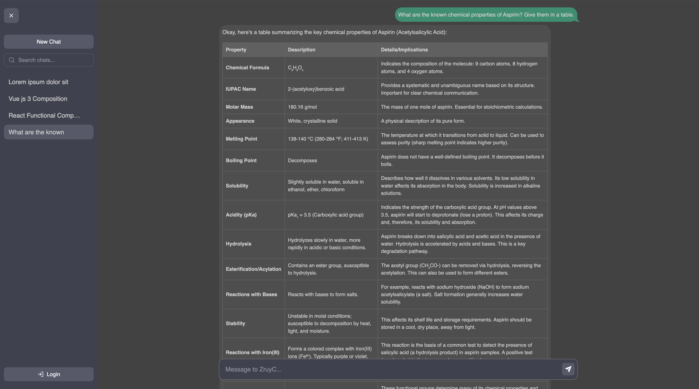

# ZruyC - AI chat Application (Powered by Gemini API)

## 📌 Project Overview
This application is a chatbot similar to ChatGPT, integrated with the **Gemini API** for AI-powered conversations. It is built using **React, Vite, TypeScript**, and **IndexedDB** for local data storage.

## 🚀 Setup Instructions

### 1️⃣ Prerequisites
Ensure you have the following installed:
- **Node.js** (v18 or later)
- **npm** or **yarn** (package manager)
- A **Google Gemini API key**

### 2️⃣ Installation Steps

1. Clone the repository:
   ```sh
   git clone <repo-url>
   cd chat-with-ai
   ```

2. Install dependencies:
   ```sh
   npm install
   ```

3. Configure your Gemini API key:
   - Add your API key to the environment variables
   - Or update the API configuration in `src/api/gemini.ts`


4. Start the development server:
   ```sh
   npm run dev
   ```

5. Open your browser and navigate to `http://localhost:5173`

## 🛠️ Technologies Used

| **Technology**      | **Purpose** |
|---------------------|------------|
| **React 18**        | Modern component-based UI development |
| **TypeScript**      | Type safety and enhanced developer experience |
| **Vite**            | Fast build tool and development server |
| **Styled Components** | CSS-in-JS styling with theme support |
| **IndexedDB**       | Local database for persistent chat storage |
| **Google Gemini API** | Advanced AI conversation capabilities |
| **React Markdown**  | Rich text rendering for AI responses |
| **React Router**    | Client-side routing and navigation |

## 🎯 Project Structure

```
src/
├── components/
│   ├── icons/           # Reusable SVG icon components
│   │   ├── index.ts     # Icon exports
│   │   ├── PlusIcon.tsx # New chat icon
│   │   ├── TrashIcon.tsx # Delete chat icon
│   │   ├── ChevronLeftIcon.tsx # Sidebar toggle icon
│   │   ├── SendIcon.tsx # Send message icon
│   │   ├── HamburgerIcon.tsx # Mobile menu toggle
│   │   ├── LoginIcon.tsx # User authentication
│   │   ├── UserIcon.tsx # User profile
│   │   ├── SearchIcon.tsx # Search functionality
│   │   ├── CloseIcon.tsx # Close/clear actions
│   │   └── ChatIcon.tsx # Chat/conversation icon
│   ├── ChatList.tsx     # Sidebar with chat management & search
│   ├── ChatWindow.tsx   # Main chat interface
│   ├── ChatInput.tsx    # Message input component
│   ├── Header.tsx       # Application header
│   ├── EmptyState.tsx   # Welcome screen component
│   ├── Search.tsx       # Search input component
│   └── SidebarContainer.tsx # Sidebar wrapper with toggle
├── hooks/
│   └── useChats.ts      # Chat state management with search
├── api/
│   └── gemini.ts        # Gemini API integration
├── db/
│   └── db.ts           # IndexedDB operations
├── theme/
│   └── colors.ts       # Centralized color system
├── types/
│   └── common.ts       # TypeScript type definitions
├── pages/
│   ├── Home.tsx        # Main application page
│   ├── About.tsx       # About page
│   └── NotFound.tsx    # 404 error page
├── assets/
│   ├── zruyc_logo.svg  # Application logo
│   └── react.svg       # React logo
├── main.tsx            # Application entry point
├── router.tsx          # Routing configuration
└── main.css            # Global styles
```

## 🎨 Design System

The application uses a comprehensive design system with:

- **Color Constants**: Centralized color management for consistency
- **Icon Components**: Reusable SVG icons with consistent styling
- **Responsive Layout**: Adaptive design for all screen sizes
- **Smooth Animations**: Polished user interactions

## 🔒 Privacy & Security

- **Local Storage**: All conversations stored locally on your device
- **No Cloud Sync**: Your data never leaves your device
- **Privacy First**: No tracking or data collection
- **Secure API**: Direct communication with Google Gemini API

## 🚀 Performance Features

- **Fast Loading**: Optimized bundle size with Vite
- **Smooth Scrolling**: Efficient chat list and message rendering
- **Memory Efficient**: Optimized state management
- **Offline Capable**: Works with cached data when offline

## 🐛 Known Limitations

- **Context Window**: Limited by Gemini API's context window size
- **API Rate Limits**: Subject to Google Gemini API rate limits
- **Local Storage**: Data is device-specific (no cross-device sync)

## 🤝 Contributing

1. Fork the repository
2. Create a feature branch (`git checkout -b feature/amazing-feature`)
3. Commit your changes (`git commit -m 'Add amazing feature'`)
4. Push to the branch (`git push origin feature/amazing-feature`)
5. Open a Pull Request

## 📝 License

This project is licensed under the MIT License - see the LICENSE file for details.

## 🖼️ Screenshots



*ZruyC provides an intuitive interface for AI-powered conversations with local data storage and privacy protection.*
